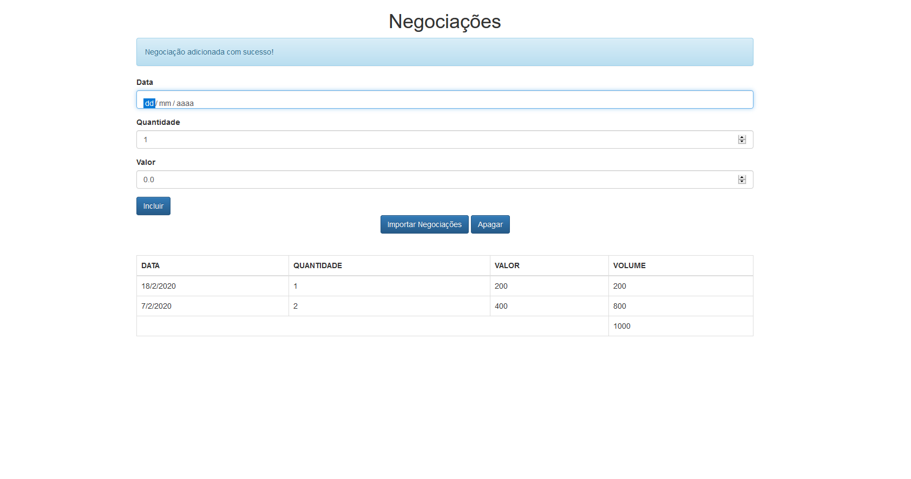

</img>

</img>

</img>

# Instalação

É um projeto simples, feito com HTML/CSS/Javascript. Apenas baixe os arquivos e abra **index.html**;
Entretanto, estou usando uma configuração do <a href="https://eslint.org/">ESLint</a> com o <a href="https://prettier.io/">Prettier</a>; configuração esta feita pelo desenvolvedor <a href="https://github.com/wesbos">wesbos</a>.
Link do repositório explicando como usar essa configuração:
<a href="https://github.com/wesbos/eslint-config-wesbos">No-Sweat™ Eslint and Prettier Setup - with or without VS Code</a>.

# Sobre o projeto

É o projeto do curso ES6+ da Alura.
Este projeto usa o modelo **MVC**, com **OOP**, além de muitas features novas do ES6+.

O guia deste projeto é : <a href="https://github.com/flaviohenriquealmeida">Flávio Henrique de Souza Almeida</a>.

# Modificações

Não são muitas, porém dentre elas:

<li>Modifiquei a forma como chamamos o listener do formulário. No projeto original, o guia chama o listener pelo HTML, já aqui eu chamo pelo próprio Javascript. (Preferência minha!)</li>
<li>Algumas modificações em estilização.</li>
<li>Adicionei um método que remove a notificação de negociação adicionada com sucesso.</li>
<li>Visto que o curso foi dividido em 3 partes, assim que eu fizer tais partes, vou commita-las neste repositório, junto com minhas modificações.</li>
